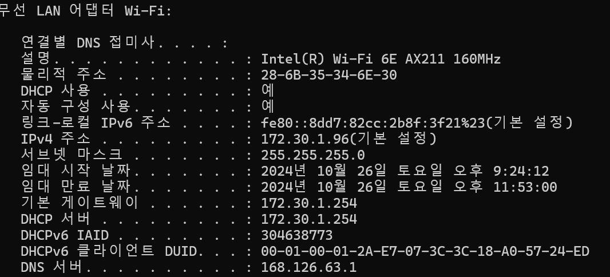

# 2024-10-27 (일) 마지막 회차

# 6-2 ) 🚀와이어샤크를 통한 프로토콜 분석

> **[ 박경우 ] 실습 및 분석**

- **실습 자료**
  - **설치 분석**
      <aside>
      ❓
      
      와이어샤크 설치 시, **WinPcap VS Npcap**
      
      |  | **개발 지원** | **성능 및 기능** | **호환성** |
      | --- | --- | --- | --- |
      | WinpCap | Windows 10 이상의 최신 운영체제와의 호환성이 제한적 | 기본적인 패킷 캡처 기능을 제공 | Windows XP부터 Windows 8.1까지 지원 |
      | NpCap | 다양한 네트워크 도구와 호환되며, Windows 10과 11에서 안정적인 성능을 제공 | Windows의 네이티브 패킷 필터링을 지원하고, 향상된 모니터 모드(Wi-Fi 캡처) 및 loopback 캡처기능을 지원 | Windows 10과 11을 포함한 최신 Windows 버전에서 안정적으로 동작 |
      </aside>

  - **패킷 분석**
    ### 👋🏻 배경
    | **분석 대상** | **Wi-Fi**         |
    | ------------- | ----------------- |
    | **분석 목표** | **TCP 상세 분석** |
    **Wi-Fi ipconfig 정보**
    
    - **⛵ TCP 분석**

      

      - **사설 IP 172.30.1.45 (사용자) → 168.126.63.1 ( KT DNS )** **3-way-handshake 요청**
        
        - **송수신** : 51398 ( 클라이언트 프로그램 동적 포트 ) → 53 ( DNS에 실행되는 포트 )
        - **순서 번호** :
          - 0 (상대적인 번호)
          - 3611214283 ( **Wi-Fi 네트워크 환경에서 패킷 순서 번호**)
        - **플래그** : SYN
        - **Window ( 수신 측에서 허용하는 최대 데이터 크기 )** : 64420 bytes
        - **Options**
          
          - **Maximum segment size (MSS / TCP 세그먼트의 최대 크기)**: 1460 bytes
          - **Window scale** : 윈도우 크기를 256배로 확장(64240 bytes → 16.4MB 확장 )
          - **SACK permitted**: 선택적 확인 응답(Selective Acknowledgment)을 허용
            - 손실된 패킷만 선택적으로 재전송 가능
        **[ SYN 이후 과정 ]**
        
        - **송수신** : 53 → 51398
        - **확인 번호** : 3611214284 ( 클라이언트의 순서 번호 + 1)
        - **플래그** : SYN , ACK
        
        - **송수신** : 51398 → 53
        - **순서 번호** : 3611214284
        - **플래그** : ACK

    - **PSH 플래그 요청**
      
      - **기존 TCP 연결** : 수신 측에서 데이터가 도착할 때까지 일부 데이터를 버퍼에 쌓아 두고, 충분한 데이터가 쌓이면 이를 애플리케이션 계층으로 전달
        → 수신 측에서 **버퍼링을 최소화**, 패킷을 받자마자 애플리케이션 계층에 전달
        → **지연 감소**
    - **TCP 패킷 조립 ( 와이어샤크 기능 )**
      
      - 프레임 600에서 TCP 패킷들이 재조립된 결과 확인
      - **play.google.com** 도메인 이름을 질의하는 DNS 요청을 재조립 후 완전한 메시지를 복원
    - **쿼리에 결과 반환**
      
      - **요청과 응답 사이의 ACK 패킷 전송 존재 이유**
        - **TCP 연결 확인 및 유지**
          - ACK 패킷은 연결이 정상적으로 유지되고 있음을 확인하는 역할
          - 응답을 보내기 전에 수신한 요청 패킷에 대한 ACK 패킷을 보냄으로서 양쪽 모두 현재 연결이 유지됨을 파악
  - **번외 분석**
      <aside>
      ❓
      
      **이미지가 포함된 포스트는 왜 이렇게 렌더링이 느린거지? 내 쿼리 문제인가?**
      
      </aside>
      
      **[ 다수의 PNG 파일이 포함된 데이터 ]**
      
      
      
      
      
      **[ 텍스트만 존재하는 데이터 ]** 
      
      
      
      
      
      - **포스트 상세 조회 API의 응답 시간은 차이가 없음**
      - **통계 > I/O 그래프** 메뉴에서 패킷 전송량을 시간 단위로 시각화하여 원인 파악
          - 이미지 파일이 포함된 트랙픽은 패킷 전송량이 많음 → **네트워크 I/O 의 문제 파악**
          - PNG를 WebP나 AVIF로 변경하면 이미지 파일 크기를 줄이고, 네트워크 I/O를 절감
